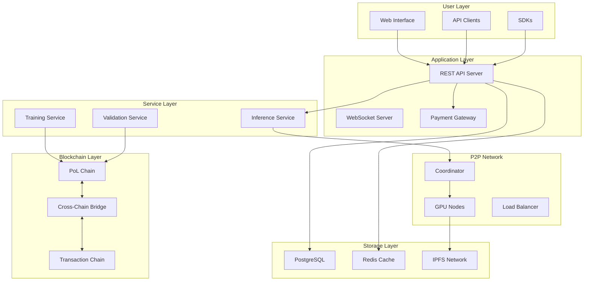
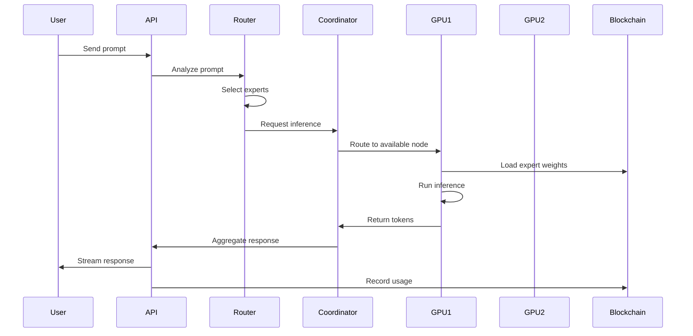
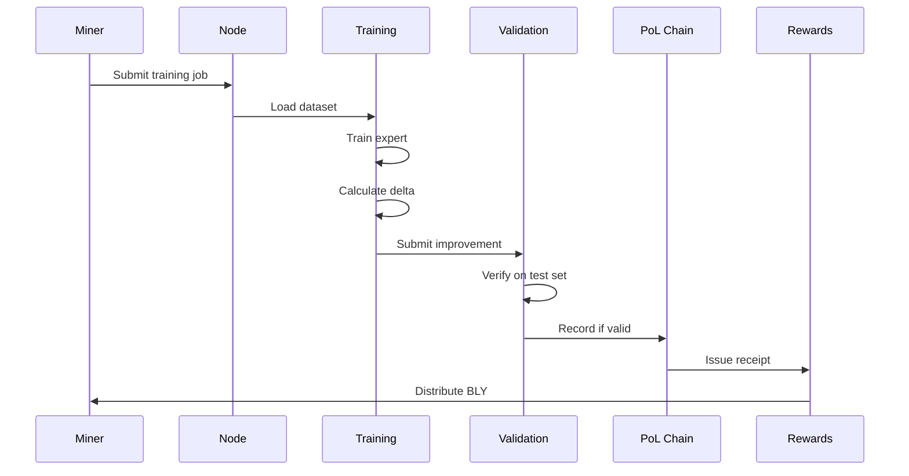
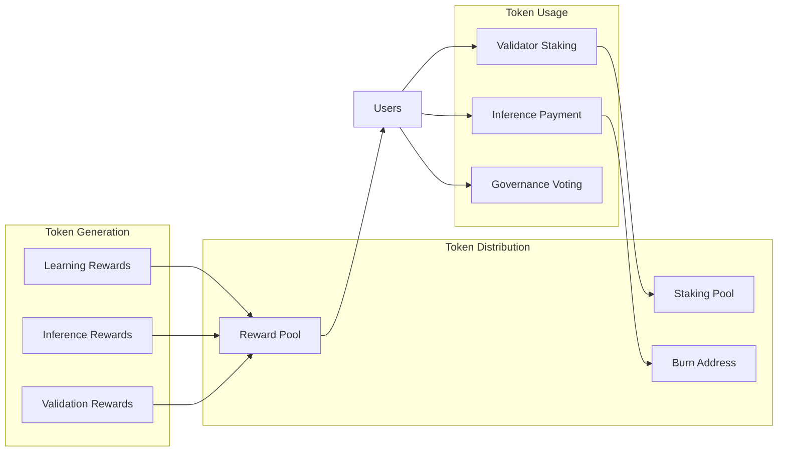
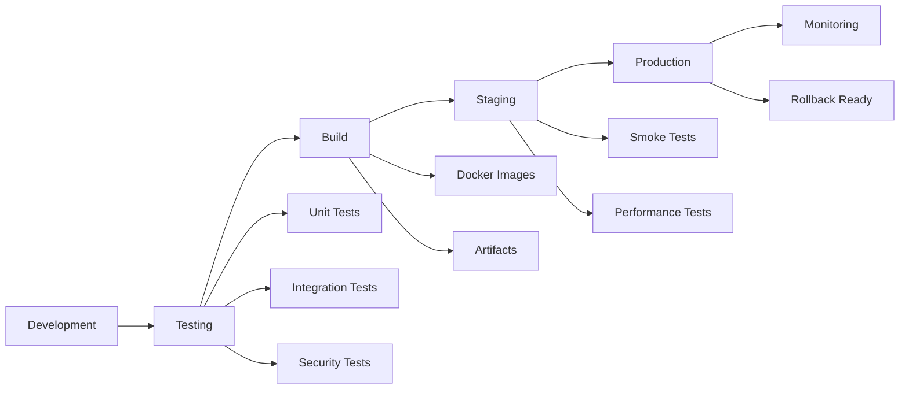

# Architecture & Flow
# Blyan Network System Architecture

## 1. System Overview



## 2. Component Architecture

### 2.1 Blockchain Architecture

#### Two-Chain Design
The system employs a dual-chain architecture to separate concerns:

**Transaction Chain (PoS+BFT)**
- Handles BLY token transfers
- Provides <2 second finality
- Uses Tendermint-style consensus
- Maintains account balances and nonces

**PoL Chain (Proof-of-Learning)**
- Records AI model improvements
- Issues reward receipts
- Stores expert weight hashes
- Validates training contributions

#### DAG Structure
```
Genesis Block
     |
Meta Block (Architecture)
     |
   / | \
Expert Blocks (Parallel Evolution)
  |   |   |
Delta Blocks (Improvements)
```

### 2.2 AI Model Architecture

#### Qwen3-8B Dense Model Structure
```
Input Layer
     |
Embedding Layer (151936 vocab)
     |
32 Transformer Layers
     |
  Each Layer:
  - Multi-Head Attention
  - Feed-Forward Network
  - Layer Normalization
     |
Output Layer (LM Head)
```

#### Model Distribution (Pipeline Parallelism)
- **Total Layers**: 32 transformer layers
- **Partitioning**: Dynamic layer assignment to GPUs
- **Memory per Layer**: ~250MB (FP8)
- **Total Model Size**: ~8GB (FP8)

### 2.3 P2P Network Topology

#### Node Types
1. **Main Node** (Service Node)
   - Central API server
   - Blockchain management
   - Coordination services
   - No GPU required

2. **GPU Nodes** (Worker Nodes)
   - Model inference
   - Expert hosting
   - Training participation
   - Validation tasks

3. **Bootstrap Nodes**
   - Network discovery
   - Peer introduction
   - NAT traversal assistance

#### Network Mesh
```
    Bootstrap Node
         /|\
        / | \
   GPU1  GPU2  GPU3
    |  \  |  / |
    |   \ | /  |
   GPU4--Main--GPU5
    |   / | \  |
    |  /  |  \ |
   GPU6  GPU7  GPU8
```

## 3. Data Flow Diagrams

### 3.1 Inference Flow



### 3.2 Training Flow



### 3.3 Token Economy Flow



## 4. System Components

### 4.1 API Server (`api/server.py`)

**Responsibilities:**
- REST endpoint management
- Request validation
- Authentication/authorization
- Response formatting
- Rate limiting

**Key Endpoints:**
- `/chat` - Inference requests
- `/mine` - Submit improvements
- `/p2p/register` - Node registration
- `/rewards/*` - Token operations

### 4.2 Blockchain Core (`backend/core/`)

**Components:**
- `chain.py` - DAG blockchain implementation
- `block.py` - Block structure and validation
- `storage.py` - Persistent storage interface
- `consensus.py` - Consensus mechanisms

**Features:**
- Cycle detection in DAG
- Topological sorting
- Merkle tree generation
- Signature verification

### 4.3 Model Manager (`backend/model/`)

**Components:**
- `manager.py` - Unified model management
- `moe_infer.py` - MoE inference engine
- `expert_cache.py` - Expert caching layer
- `router.py` - Expert routing logic

**Capabilities:**
- Selective expert loading
- Memory-mapped tensors
- Quantization support
- Version management

### 4.4 P2P Coordinator (`backend/p2p/`)

**Components:**
- `distributed_inference.py` - Inference coordination
- `node_registry.py` - Node management
- `heartbeat.py` - Health monitoring
- `load_balancer.py` - Request distribution

**Features:**
- Automatic failover
- Geographic routing
- Expert group optimization
- Donor mode support

### 4.5 Learning System (`backend/learning/`)

**Components:**
- `consensus_learning.py` - Distributed training
- `micro_step_trainer.py` - Incremental training
- `pipeline_parallel.py` - Pipeline parallelism
- `delta_compression.py` - Weight compression

**Capabilities:**
- Byzantine fault tolerance
- Synchronized epochs
- Delta aggregation
- Gradient accumulation

## 5. Deployment Architecture

### 5.1 Production Deployment

```yaml
Main Node (DigitalOcean):
  - Location: NYC3
  - Specs: 4vCPU, 8GB RAM
  - Services:
    - API Server
    - PostgreSQL
    - Redis
    - Nginx

GPU Nodes (RunPod/Custom):
  - Locations: Global
  - Specs: RTX 4090+
  - Services:
    - Expert hosting
    - Inference engine
    - Training worker
```

### 5.2 Container Architecture

```dockerfile
# Base Services
blyan-api:       FastAPI application
blyan-postgres:  Database with replication
blyan-redis:     Cache and sessions
blyan-nginx:     Reverse proxy + SSL

# GPU Services
blyan-gpu-node:  GPU worker node
blyan-trainer:   Training service
blyan-validator: Validation service
```

### 5.3 Scaling Strategy

**Horizontal Scaling:**
- API servers behind load balancer
- Multiple GPU nodes per region
- Redis cluster for caching
- PostgreSQL read replicas

**Vertical Scaling:**
- GPU memory for larger models
- CPU cores for parallel processing
- Network bandwidth for expert transfer
- Storage for blockchain data

## 6. Security Architecture

### 6.1 Defense Layers

```
Layer 1: Network Security
  - TLS 1.3 encryption
  - DDoS protection (Cloudflare)
  - Rate limiting
  
Layer 2: Authentication
  - SIWE (Sign-In with Ethereum)
  - API key authentication
  - mTLS for node-to-node

Layer 3: Authorization
  - Role-based access control
  - Resource quotas
  - Token-gated features

Layer 4: Data Integrity
  - Merkle proofs
  - Activation beacons
  - Weight verification

Layer 5: Consensus Security
  - Byzantine fault tolerance
  - Slashing conditions
  - Stake requirements
```

### 6.2 Attack Mitigation

**Model Poisoning:**
- Multi-node validation
- Statistical anomaly detection
- Rollback mechanisms

**Sybil Attacks:**
- Proof-of-Work challenges
- Hardware fingerprinting
- Stake requirements

**Data Leakage:**
- Differential privacy
- Secure enclaves
- Encrypted storage

## 7. Performance Architecture

### 7.1 Optimization Strategies

**Inference Optimization:**
- KV-cache management
- Batch processing
- Speculative decoding
- Expert caching

**Network Optimization:**
- Connection pooling
- Request batching
- Compression (gzip)
- CDN integration

**Storage Optimization:**
- Memory-mapped files
- Zero-copy tensors
- Lazy loading
- Tiered storage

### 7.2 Caching Layers

```
L1 Cache: Redis (Hot Data)
  - Session data
  - Recent inferences
  - Node registry
  
L2 Cache: Local Memory
  - Expert weights
  - Routing tables
  - Validation results

L3 Cache: Disk Cache
  - Model checkpoints
  - Training datasets
  - Historical data
```

## 8. Monitoring & Observability

### 8.1 Metrics Collection

```yaml
Prometheus Metrics:
  - API latency histograms
  - GPU utilization gauges
  - Token distribution counters
  - Network throughput rates
  - Error rate summaries
```

### 8.2 Logging Architecture

```
Application Logs -> Filebeat -> Logstash -> Elasticsearch -> Kibana
                      |
                      v
                  CloudWatch (Backup)
```

### 8.3 Alerting Rules

**Critical Alerts:**
- API downtime > 1 minute
- GPU node failure > 10%
- Blockchain fork detection
- Security breach attempts

**Warning Alerts:**
- High latency (>1s p99)
- Low GPU availability
- Budget exhaustion
- Certificate expiration

## 9. Development Workflow

### 9.1 CI/CD Pipeline



### 9.2 Environment Configuration

**Development:**
- Local blockchain
- Mock GPU nodes
- Test tokens
- Debug logging

**Staging:**
- Testnet deployment
- Real GPU nodes
- Test tokens
- Production-like load

**Production:**
- Mainnet deployment
- Global GPU network
- Real BLY tokens
- Full monitoring

## 10. Future Architecture

### 10.1 Planned Enhancements

**Phase 1 (Q3 2025):**
- NAT traversal implementation
- Storage backend upgrade
- Consensus mechanism enhancement

**Phase 2 (Q4 2025):**
- Multi-region deployment
- Cross-chain bridges
- Mobile SDK release

**Phase 3 (2026):**
- Autonomous evolution
- Multi-modal support
- DAO governance

### 10.2 Scalability Roadmap

**Current Scale:**
- 100 GPU nodes
- 10K daily users
- 20B parameter model

**Target Scale (2026):**
- 10K GPU nodes
- 1M daily users
- 100B+ parameter models

## Appendices

### A. Technology Stack
- Python 3.10+
- PyTorch 2.0+
- FastAPI
- PostgreSQL 14+
- Redis 7+
- Docker/Kubernetes
- Prometheus/Grafana

### B. Directory Structure
```
blyan/
├── api/           # API endpoints
├── backend/       # Core logic
├── blockchain/    # Chain implementations
├── frontend/      # Web UI
├── scripts/       # Utilities
├── tests/         # Test suites
└── docs/          # Documentation
```

### C. Configuration Files
- `config/tokenomics.yaml` - Economic parameters
- `config/system.yaml` - System settings
- `config/network.yaml` - P2P configuration
- `.env` - Environment variables

---
*Last Updated: January 2025*
*Version: 1.0.0*