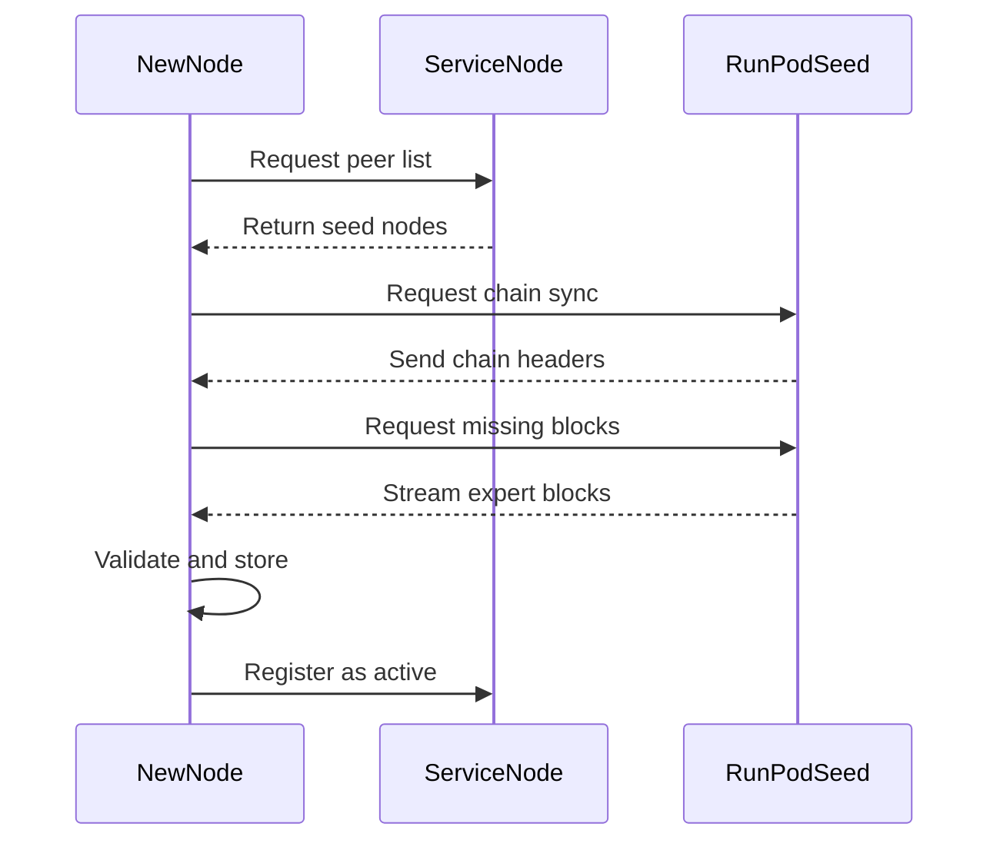

# 🌱 Seed Node Architecture

## Overview
Blyan Network uses a seed node architecture where RunPod GPU nodes serve as permanent seeds that store the complete blockchain and expert weights.

## 🎯 Design Philosophy

### Why RunPod as Seed Nodes?
1. **Persistent Storage**: GPU nodes have large storage for expert weights
2. **High Bandwidth**: Fast upload/download for chain synchronization
3. **Always Available**: Paid infrastructure ensures 24/7 availability
4. **GPU Power**: Can serve inference requests while seeding

### Service Node Role (DigitalOcean)
1. **API Gateway**: Handle HTTP requests from users
2. **Request Router**: Route to appropriate expert nodes
3. **Chain Relay**: Help propagate blocks (but don't store experts)
4. **NO Local Models**: Pure blockchain-based operation

## 📊 Node Types

| Node Type | Storage | Inference | Mining | Seed |
|-----------|---------|-----------|--------|------|
| **RunPod GPU** | Full chain + Experts | ✅ Yes | ✅ Yes | ✅ Primary |
| **Service Node** | Meta chain only | ❌ No | ❌ No | ✅ Secondary |
| **New User Node** | Syncs from seeds | ✅ Optional | ✅ Optional | ❌ No |

## 🔄 Chain Synchronization Process

### When a New Node Joins



### Synchronization Steps

1. **Discovery Phase**
   ```python
   # New node discovers seeds
   seeds = discover_seed_nodes()
   # Returns: ['runpod-1.blyan.com:8001', ...]
   ```

2. **Header Sync**
   ```python
   # Get chain headers first (lightweight)
   for chain_id in ['A', 'B', 'D']:
       headers = seed.get_chain_headers(chain_id)
       validate_headers(headers)
   ```

3. **Block Download**
   ```python
   # Download blocks in chunks
   for block_hash in missing_blocks:
       block = seed.get_block(block_hash)
       if validate_block(block):
           chain.add_block(block)
   ```

4. **Expert Weights (Optional)**
   ```python
   # Only if node will serve inference
   if node_config.serve_inference:
       for expert_id in required_experts:
           expert_data = seed.get_expert(expert_id)
           store_expert_locally(expert_data)
   ```

## 💰 Economic Model

### Seed Node Incentives
- **Seeding Rewards**: BLY tokens for bandwidth provided
- **Inference Rewards**: Additional BLY for serving requests
- **Priority Access**: First to receive new expert uploads

### Cost Structure
```yaml
RunPod Costs (Paid by Foundation initially):
  - GPU Instance: $0.79/hour (RTX 3090)
  - Storage: $0.10/GB/month
  - Bandwidth: $0.09/GB

Revenue Sources:
  - Inference fees from users
  - Mining rewards from new blocks
  - Seeding rewards from network
```

## 🚀 Implementation

### Environment Variables
```bash
# For RunPod seed nodes
export NODE_TYPE=seed
export STORE_EXPERTS=true
export SERVE_INFERENCE=true
export CHAIN_SYNC_PROVIDER=true

# For service nodes
export NODE_TYPE=service
export BLOCKCHAIN_ONLY=true
export STORE_EXPERTS=false
export SERVE_INFERENCE=false
```

### Seed Node Setup (RunPod)
```python
# runpod_seed_node.py
class SeedNode:
    def __init__(self):
        self.chains = {
            'A': Chain(Path('./data'), 'A'),  # Meta
            'B': Chain(Path('./data'), 'B'),  # Experts
            'D': Chain(Path('./data'), 'D'),  # Datasets
        }
        self.expert_storage = ExpertStorage('./experts/')
        
    def serve_sync_request(self, peer, chain_id, start_block):
        """Serve chain sync to new nodes"""
        chain = self.chains[chain_id]
        blocks = chain.get_blocks_from(start_block)
        
        for block in blocks:
            peer.send_block(block)
            # Track bandwidth for rewards
            self.track_bandwidth(len(block.data))
    
    def handle_expert_request(self, expert_id):
        """Serve expert weights for inference"""
        expert_data = self.expert_storage.get(expert_id)
        return expert_data
```

### New Node Sync
```python
# new_node_sync.py
async def sync_from_seeds():
    # 1. Get seed list
    seeds = get_seed_nodes()  # From config or DHT
    
    # 2. Connect to fastest seed
    fastest_seed = await find_fastest_seed(seeds)
    
    # 3. Sync chains
    for chain_id in ['A', 'B', 'D']:
        await sync_chain(fastest_seed, chain_id)
    
    # 4. Verify completeness
    if verify_chain_integrity():
        print("✅ Synchronization complete!")
        return True
    
    return False
```

## 📈 Scaling Strategy

### Phase 1: Foundation Seeds (Current)
- 2-3 RunPod nodes maintained by foundation
- Ensures network availability during bootstrap

### Phase 2: Community Seeds (3-6 months)
- Incentivize community to run seed nodes
- Higher rewards for consistent uptime

### Phase 3: Decentralized Seeds (6-12 months)
- DHT-based peer discovery
- No fixed seed nodes needed
- Full P2P synchronization

## 🔒 Security Considerations

### Seed Node Security
1. **DDoS Protection**: Rate limiting on sync requests
2. **Sybil Resistance**: Verify node stakes before serving
3. **Data Integrity**: Merkle proofs for all blocks
4. **Bandwidth Limits**: Cap per-peer bandwidth usage

### Trust Model
```python
# Verify seed node authenticity
def verify_seed_node(node):
    # Check if node is in official seed list
    if node in OFFICIAL_SEEDS:
        return True
    
    # Check stake for community seeds
    if node.stake >= MIN_SEED_STAKE:
        return True
    
    # Check reputation score
    if node.reputation >= MIN_REPUTATION:
        return True
    
    return False
```

## 📋 Configuration

### Official Seed Nodes
```yaml
seeds:
  primary:
    - host: runpod-gpu-1.blyan.com
      port: 8001
      region: us-east
      capacity: 100TB
      bandwidth: 10Gbps
  
  secondary:
    - host: runpod-gpu-2.blyan.com
      port: 8001
      region: eu-west
      capacity: 100TB
      bandwidth: 10Gbps
```

## ✅ Benefits

1. **Quick Onboarding**: New nodes sync in minutes, not hours
2. **High Availability**: Multiple seeds ensure redundancy
3. **Cost Effective**: Cheaper than everyone storing everything
4. **Progressive Decentralization**: Start centralized, become decentralized
5. **Quality Control**: Verified seeds provide clean chains

## 🚨 Current Status

- **RunPod Seeds**: Need to be deployed with full model
- **Service Node**: Configured for blockchain-only mode ✅
- **Sync Protocol**: Basic implementation exists
- **Incentive System**: Needs implementation

The seed node architecture ensures network bootstrapping while maintaining the path to full decentralization!