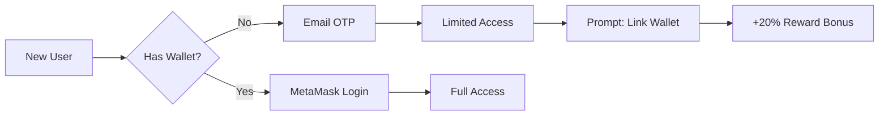

# 🔐 Blyan Authentication Roadmap

## Overview
Progressive authentication strategy: MetaMask → Dual Auth → Native BLY Wallet

## Phase 1: MetaMask Launch (NOW - Week 1) ✅

### Completed
- ✅ Ethereum signature verification (`backend/api/wallet_auth.py`)
- ✅ MetaMask frontend integration (`frontend/metamask_auth.js`)
- ✅ Nonce-based replay protection
- ✅ Redis session storage (with fallback)

### Integration Steps
```bash
# Install dependencies
pip install eth-account redis

# Set environment variables
export REDIS_URL=redis://localhost:6379

# Test authentication
curl -X POST http://localhost:8000/wallet/request_nonce \
  -H "Content-Type: application/json" \
  -d '{"address": "0x742d35Cc6634C0532925a3b844Bc9e7595f0bEb7"}'
```

### Frontend Integration
```html
<script src="metamask_auth.js"></script>
<script>
const auth = new BlyanAuth();

async function login() {
    try {
        const userInfo = await auth.connect();
        document.getElementById('balance').innerText = userInfo.bly_balance + ' BLY';
    } catch (error) {
        alert(error.message);
    }
}
</script>
```

### Test Cards for Development
- MetaMask: Any Ethereum address works in test mode
- Stripe: `4242 4242 4242 4242` (any future expiry, any CVC)

## Phase 2: Dual Authentication (Month 2-3)

### Goals
- Add email OTP for non-crypto users
- Link email accounts to wallet addresses
- Incentivize wallet adoption (+20% rewards)

### Implementation Plan
```python
# backend/api/wallet_auth.py
@router.post("/request_otp")
async def request_otp(email: str):
    otp = generate_otp()
    send_email(email, otp)
    return {"message": "OTP sent"}

@router.post("/verify_otp")
async def verify_otp(email: str, otp: str):
    if verify_otp_code(email, otp):
        # Create temporary account
        # Prompt to link wallet for full features
        return {"token": session_token, "wallet_required": True}
```

### User Flow


## Phase 3: Native BLY Wallet (Month 6-12)

### Trigger Conditions
```python
if (
    daily_active_users > 10_000 AND
    monthly_revenue > 100_000 AND
    series_a_raised == True
):
    start_native_wallet_development()
```

### Architecture
- **Key Type**: Ed25519 (faster than secp256k1)
- **Storage**: Encrypted local + cloud backup
- **Recovery**: 12-word mnemonic phrase
- **Platforms**: Browser extension + Mobile app

### Migration Strategy
1. **Dual Support Period** (3 months)
   - Both MetaMask and BLY Wallet work
   - Automatic balance sync

2. **Incentivized Migration**
   - 100 BLY bonus for switching
   - Exclusive features in native wallet

3. **Deprecation**
   - MetaMask becomes read-only
   - Full transition to native wallet

## Payment Integration Timeline

### Week 1: Stripe Test Mode ✅
```bash
# Test webhook locally
stripe listen --forward-to localhost:8000/payment/webhook

# Create test payment
curl -X POST http://localhost:8000/payment/test_payment
```

### Week 2: Production Stripe
```bash
export STRIPE_SECRET_KEY=sk_live_...
export STRIPE_WEBHOOK_SECRET=whsec_...
```

### Month 2: Crypto Payments
- USDC on Polygon
- Direct BLY purchases
- DEX liquidity pool

## Success Metrics

| Metric | Phase 1 Target | Phase 2 Target | Phase 3 Target |
|--------|---------------|----------------|----------------|
| Signup Conversion | 15% | 35% | 50% |
| Wallet Linked | 100% | 60% | 100% |
| Payment Success | 85% | 90% | 95% |
| Auth Time | <3s | <2s | <1s |

## Security Checklist

### Phase 1 (Current)
- [x] Signature verification
- [x] Nonce replay protection
- [x] Session expiry (24h)
- [x] Redis session storage
- [ ] Rate limiting (TODO)
- [ ] IP whitelist (optional)

### Phase 2
- [ ] Email verification
- [ ] 2FA support
- [ ] Device fingerprinting
- [ ] Suspicious activity detection

### Phase 3
- [ ] Hardware wallet support
- [ ] Multi-sig for high-value accounts
- [ ] Social recovery
- [ ] Biometric authentication (mobile)

## Cost Analysis

### Phase 1 (MetaMask Only)
- Development: $500 (3 days)
- Infrastructure: $0
- User acquisition: $5/user
- **Total**: $5,000 (1000 users)

### Phase 2 (Dual Auth)
- Development: $2,000 (2 weeks)
- Email service: $100/month
- SMS (optional): $500/month
- **Total**: $8,000 (6 months)

### Phase 3 (Native Wallet)
- Development: $50,000 (3 months)
- Security audit: $30,000
- App store fees: $200/year
- Maintenance: $5,000/month
- **Total**: $110,000 (first year)

## Quick Start Commands

```bash
# 1. Install dependencies
pip install eth-account stripe redis

# 2. Set environment variables
export STRIPE_SECRET_KEY=sk_test_...
export REDIS_URL=redis://localhost:6379

# 3. Run authentication tests
python -m pytest tests/test_wallet_auth.py

# 4. Start server with auth
python startup.py

# 5. Test MetaMask login
open frontend/test_auth.html
```

## Support & Troubleshooting

### Common Issues

**"MetaMask not detected"**
- Install from: https://metamask.io
- Refresh page after installation

**"Invalid signature"**
- Ensure correct network (Ethereum Mainnet)
- Check account is unlocked

**"Nonce already used"**
- Nonce expires after 5 minutes
- Request new nonce if expired

**"Payment failed"**
- Check Stripe webhook configuration
- Verify API keys are correct
- Use test cards in development

## Next Steps

1. **Today**: Test MetaMask authentication
2. **This Week**: Deploy Stripe webhook
3. **Next Week**: Production deployment
4. **Month 2**: Start Phase 2 (Email OTP)
5. **Month 6**: Evaluate Phase 3 readiness

---

**Questions?** Contact: team@blyan.network
**Documentation**: https://docs.blyan.network/auth
**Status Page**: https://status.blyan.network